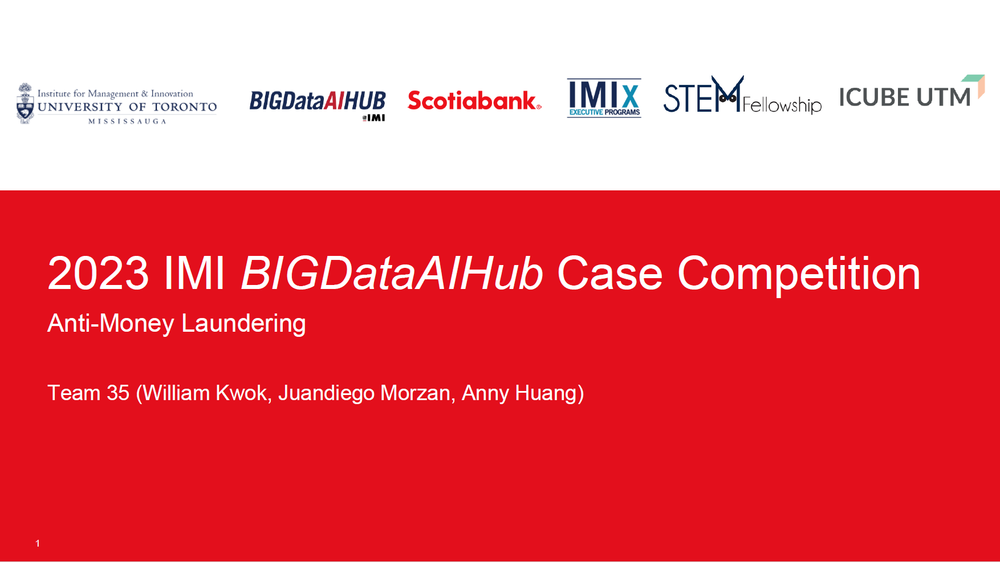
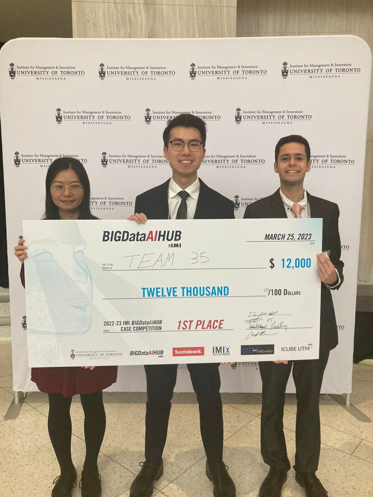

# Detect money laundering using criminal networks

1st place ([announcement](https://www.linkedin.com/feed/update/urn:li:activity:7045542079829086208/) and [presentation PDF](https://github.com/WillKWL/2023_IMI_BIGDataAIHUB/blob/main/data/IMI_Team35_Slides_Final_v3.pdf)), 2022-23 IMI BIGDataAIHUB Case Competition

- The [competition](https://www.utm.utoronto.ca/bigdataaihub/events/2022-23-imi-bigdataaihub-case-competition) sponsored by Scotiabank and UofT BIGDataAIHUB was held from November 2022 to March 2023, and was open to graduate students (masters, PhD) and undergrads with big data/AI experience from any academic discipline at University of Toronto
- Contributors:
  - Anny Huang
  - Juandiego Morzán Samamé
  - William Kwok

 

## Problem statement

- __Ideally__,
  - Financial institutions can prevent money-laundering criminals from infiltrating the banking network by employing a manual Know-Your-Customer (KYC) and ongoing monitoring process conducted by a high number of well-trained staff.
- __In practice__,
  - While misclassifying a regular customer as a criminal may damage relationship with the customer, misclassifying a criminal as a regular customer is far worse with the potential to face substantial reputational damage and heavy regulatory fines.
  - The sheer volume of new account registrations and the ever-growing number of payment transaction necessitate an automated and cost-efficient monitoring system to identify suspicious criminals who are constantly innovating ways to “legitimize” their funds through the financial system.
- __Consequences for ineffective Anti-Money Laundering (AML) practice:__
  - For customers and the society, ineffective combat against money laundering can lead to financial exclusion for marginalized individuals, while failure to cut off terrorist activity financing can cause pervasive disruption in the financial system.
  - For banks, it poses a substantial risk of undermining their reputation and overall performance.

## Modeling tasks

### Task 1

- Data = 1 million synthetic customer names (synthetic) and OpenSanctions watchlist
- Ask = identify 50 bad actors in customer database using public watchlist
  - NLP technique that can be flexible enough to handle minor discrepancies in spelling, efficient enough to process a significant volume of matches, and comprehensive enough to consider additional personal information beyond just the name itself (e.g. date of birth and politically exposed person affiliations)
- More details about our code implementation and discussion
  - [Task 1 README](https://github.com/WillKWL/2023_IMI_BIGDataAIHUB/blob/main/Task1)

### Task 2A and 2B

- Data = synthetic KYC and transaction data of 1 million customers
- Ask =
  - Task 2A: score customers as low, medium and high risk tiers based on their likelihood of engaging in money-laundering activities
    - "Multi-class classification" that can take into account the ranking information provided by the label
  - Task 2B: find 50 bad actors from a pool of 1 million customers based on their likelihood of engaging in money-laundering activities.
    - Binary classification with highly imbalanced data (50 bad actors / 1,000,000 customers = 0.005%)
    - Anomaly detection
- More details about our code implementation and discussion
  - [Task 2A README](https://github.com/WillKWL/2023_IMI_BIGDataAIHUB/blob/main/Task2A)
  - [Task 2B README](https://github.com/WillKWL/2023_IMI_BIGDataAIHUB/blob/main/Task2B)

### Task 3

- Data: same as Task 2 + directed payments between customers (graph)
- Ask = enhance task 2 models by using client connections to either:
  - Extract new features
  - Fit graph models directly
  - Visualize interesting networks
- More details about our code implementation and discussion
  - [Task 3 README](https://github.com/WillKWL/2023_IMI_BIGDataAIHUB/blob/main/Task3)

## 3 stages of money laundering

Money laundering refers to the act of “turning the proceeds of crime into cash or property that looks legitimate and can be used without suspicion”.

### Stage 1: Placement

- Money laundering starts by placing funds derived from illegal activities into the financial system in the form of cash deposits, cheque, money transfers or any type of transaction where money enters the Bank.
- Placement can be identified at the frontline by understanding the source of the funds.

### Stage 2: Layering

- Second stage is for a criminal to move funds around to hide their illegal origins. It may consist of multiple transactions without clear purpose to move money between products, clients, bank, corporations and geographies.
- Layering can be detected by understanding transaction purpose and if it is unusual for the customer.

### Stage 3: Integration

- The final stage integrates the illicit proceeds, that now appear to be clean funds, into the economy as "normal" personal or business transactions. By this stage is hard to distinguish between legal and illegal money, and the criminals can now use these funds without suspicion.
- Integration can be detected by knowing the client and monitor for odd and unusual transactions.
