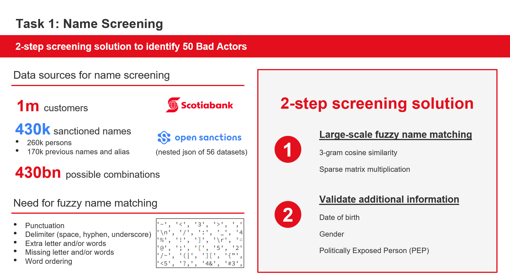
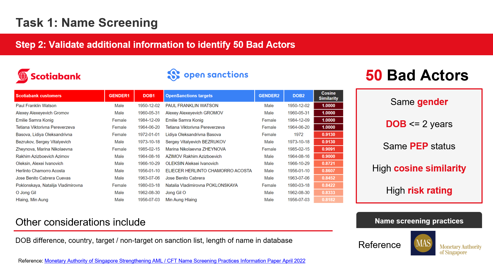

# Highlights
- Expedited large-scale fuzzy name matching by computing cosine similarity of vector space model in CSR sparse matrix format to detect bad actors among 430 billion combinations
- Made reference to Monetary Authority of Singapore's [2022 AML name screening practices](https://www.mas.gov.sg/-/media/MAS-Media-Library/publications/monographs-or-information-paper/IMD/2022/Strengthening-AML-CFT-Name-Screening-Practices.pdf)

# Overview

# 1) Business background
- Problem statement
  - __Ideally__, financial institutions can prevent money-laundering criminals from infiltrating the banking network by employing a manual Know-Your-Customer (KYC) and ongoing monitoring process conducted by well-trained staff.
  - __In practice__, the sheer volume of new account registrations necessitates an automated screening system to identify trustworthy customers. However, criminals can manipulate personal identification details to exploit vulnerabilities in this system.
  - __Consequences:__ For both customers and the society as a whole, this situation could lead to an inability to effectively counter money-laundering activities. For banks, it poses a substantial risk of undermining their reputation and overall performance.
  - __Proposal:__ One proposal is to find known high risk people in customer database using public data with a <ins>screening algorithm</ins> that can be
    - Flexible enough to handle minor discrepancies in spelling,
    - Efficient enough to process a significant volume of matches, and
    - Comprehensive enough to consider additional personal information beyond just the name itself (e.g. date of birth and politically exposed person affiliations).
  - __Use Case:__ Suspicious clients will not be allowed to open an account, or if they already did, their accounts will be frozen
- Data sources
  - UofT_nodes.csv (Scotiabank list of 1 million synthetic customer names)
  - [OpenSanctions watchlist](https://www.opensanctions.org/datasets/default/) (430 thousand sanctioned persons)
- Business objective
  - Detect 50 Bad actors in our customer base using public data sources
- Analytical problem
  - NLP fuzzy matching algorithm that can continuously monitor client names with most updated watchlists
- Success criteria
  - Qualitative assessment of the 50 bad actor matches
 
# 2) Data Understanding
- Attributes: 
  - Source of dataset (datasets)
  - Unique identifier (id)
  - Name (caption / name / alias / weakAlias / previousName)
  - BirthDate
  - Gender
  - Country / nationality
- Data quality issues
  - Possible variations of the same name:
    - Spelling mistake
    - Random abbreviation
    - Nicknames and alias
    - Shuffling of first, middle and last name due to different conventions
    - Phonetic error due to inconsistent translation from other languages
  - Conclusion
    - There is a need for fuzzy name matching logic as exact name matching cannot capture these variations of the same name

# 3) Data preparation
- Data cleaning to address data quality issues
  - Remove all non-english characters, e.g. Иван
  - Remove all punctuation and spaces between characters: no assumption in delimiter being space or underscore or hyphen
  - Make all letters lowercase
- Final output
  - yoU!ng ma? Rie mil#Dren col@EmAn -> youngmariemildrencoleman

# 4) Modeling
- List of appropriate modelling techniques
  - Vector space model
    - Bag of words / TF-IDF
  - Fuzzy matching
    - Levenshtein distance / Jaro-Winkler distance / Cosine similarity / Jaccard similarity
  - Phonetic algorithms
    - Soundex / Metaphone / Double Metaphone
- Constraints in runtime
  - Checking all combinations is computationally infeasible
    - A total of 430 billion combinations between 1 million customer names and 430 thousand sanctioned persons 
  - Checking all combinations is inefficient
    - Most pairs have low similarity scores and can be ignored
- Chosen model
  - Bag of words + binary occurrence
    - Very short texts (e.g. names) are likely to have noisy tf–idf values while binary occurrence values are more stable
  - 3-gram
    - Flexibility to handle minor discrepancies in spelling and ordering of words
- Similarity measure
  - Cosine similarity computed using CSR sparse matrix format
    - Simple matrix multiplication is efficient to compute
    - CSR sparse matrix format allows defining a threshold to filter out pairs with low similarity scores ([reference](https://www.sun-analytics.nl/posts/2017-07-26-boosting-selection-of-most-similar-entities-in-large-scale-datasets/))
- Procedure to test a model's quality and validity
  - Name to match = 'Young Marie Mildren'
  - Draw intuition from contrastive learning to manually define a set of examples containing
    - Positive examples: Possible variations of the same name (e.g.     'Young MarieMildren', 'Young M Mildren', 'Young, Maarrie Mildren', 'Young, Mildren', 'Young, aMrei Mildren', 'Marie Mildren Young', 'Yung Mary Mildren' etc.)
    - Negative examples: Names that are not the same person (e.g. Arei mr Remi.)
  - A good fuzzy matching algorithm should be able to assign a high similarity score to these variations
  - 
- Final matching algorithm
  - Other considerations beyond just the name itself
    - Date of birth
    - Country
    - Politically exposed person affiliations
  - Similarity is calculated as (1 - abs(difference)) / max(abs(difference))
  - Prioritize results with 
    - Exact match in name
    - Difference in date of birth <= 2 years
    - Length of name >= 3 to avoid just matching first and last name
  - Only match if RISK = "high" for each customer
  - Sort by average similarity score
  - Remove multiple matches for the same customer (i.e. only keep the one with the highest similarity score)

# 5) Evaluation
- Output = list of bad actors
  - 
- Issues with current solution
  - Heuristic-driven choice of bag-of-words with 3-gram as our choice of vector space model
  - Heuristic-driven decision to combine similarity measures across name, date of birth and other personal information into an average similarity score is not optimal
  - There is no ground truth to evaluate the quality of the matches
    - We can only rely on qualitative assessment of the matches
  - Deployment option is not considered
    - Continuous monitoring of new customer names against updated watchlists is required
  - More manual exclusion
    - Titles
    - Legal entity status
    - Common words e.g. Sr/Jr / II / III
  - Did not utilize existing [pairs data](https://www.opensanctions.org/docs/pairs/) from OpenSanctions
    - The data has two entities on each line, and a judgement that states if the two records refer to the same logical item (positive) or if they are different logical items (negative)
- Possible next steps
  - Scheduled deployment to check against updated watchlists
  - If given the ground truth, a more robust matching algorithm (e.g. denoising autoencoder) can be trained to find the best matches

# References
Monetary Authority of Singapore AML Name Screening Practices 2022
https://www.mas.gov.sg/-/media/MAS-Media-Library/publications/monographs-or-information-paper/IMD/2022/Strengthening-AML-CFT-Name-Screening-Practices.pdf

Current approach in fuzzy name matching
- https://pypi.org/project/sparse-dot-topn/
- https://medium.com/wbaa/https-medium-com-ingwbaa-boosting-selection-of-the-most-similar-entities-in-large-scale-datasets-450b3242e618
- https://www.sun-analytics.nl/posts/2017-07-26-boosting-selection-of-most-similar-entities-in-large-scale-datasets/

Other approaches
- https://towardsdatascience.com/fuzzy-matching-at-scale-84f2bfd0c536
- https://bergvca.github.io/2017/10/14/super-fast-string-matching.html
- https://towardsdatascience.com/how-to-build-a-smart-search-engine-a86fca0d0795
- https://towardsdatascience.com/how-to-build-a-search-engine-9f8ffa405eac
- oreilly book https://learning-oreilly-com.ezproxy.torontopubliclibrary.ca/library/view/natural-language-processing/9781617294631/OEBPS/Text/03.html#ch03lev1sec2
- annoy for nearest neighbors https://pypi.org/project/annoy/
- word2vec embedding https://radimrehurek.com/gensim/models/word2vec.html 
