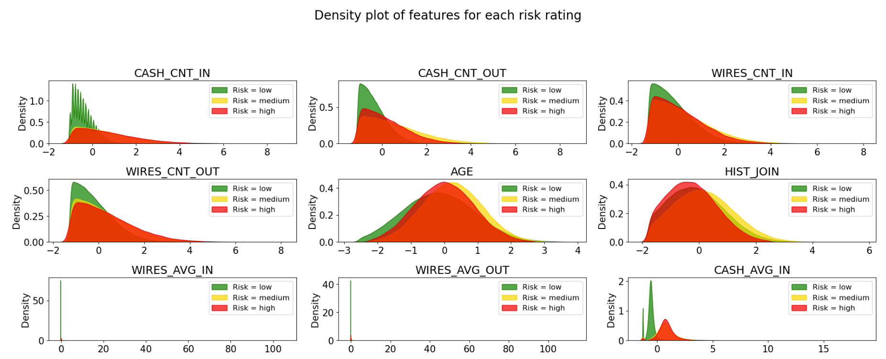
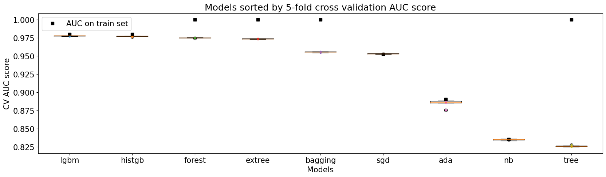

# Overview

 
 

## 1) Business background

- Problem statement see [main README](https://github.com/WillKWL/2023_IMI_BIGDataAIHUB/tree/main#task-2a-and-2b)
- Analytical problem = <ins>ordinal regression</ins>
  - Classify customers into "Low", "Medium" and "High" risk ratings
  - Why ordinal?
    - 4 levels of measurement = nominal, ordinal, interval and ratio
    - Nominal: order doesn't matter
    - Ordinal: order matters but the difference between measurements is not numerical
    - Interval: order matters with a fixed interval between measurements
    - Ratio: Interval + only positive values
  - Target variable belongs to ordinal data
- Available data
  - Synthetic KYC and transactional data (UofT_nodes.csv)
  - Target variable = risk rating
- Challenges in this task
  - We need a model that performs neither classification nor regression but ranking
  - We need a metric that can best evaluate our model's performance in ranking
- Use case
  - Instead of resorting to a binary decision that could only lead to either allowing or denying a customer's access to banking services, we can leverage the customer's risk score to allow access to a certain extent. For instance,
  - How long to freeze the customer's account?
  - How much monitoring to apply to the customer's activities?
  - What range of services are safe to open the access to the customer?
- Business terminology
  - [FINTRAC indicators](https://fintrac-canafe.canada.ca/guidance-directives/transaction-operation/indicators-indicateurs/fin_mltf-eng#s8) of a high-risk customer include:
    - Anonymity (having multiple transactions below the reporting threshold amount)
    - Speed over cost-effectiveness (splitting a single large wire transfers into multiple wire transfers of smaller amounts so the transfers would not attract attention)

## 2) Data Understanding

- 
- Volumetric analysis
  - Unit of analysis: customer
    - Each row represents summary statistics of a customer's transactions in the last 12 months
  - Number of rows = 1 million
  - Number of columns = 20
    - 1 target variable (risk rating) and 19 features of KYC and transactional data
- Features in the format of <Attribute (type): business meaning>
  - RISK (str, categorical): customer risk rating  (target variable) 
  - KYC
    - CUSTOMER_ID (int): customer_id  (unique identifier) 
    - COUNTRY_RISK_INCOME (int): country of income risk rating
    - COUNTRY_RISK_RESIDENCY (int): country of residency risk rating
    - NAME (str): name of customer
    - Gender (bool): gender of customer
    - BIRTH_DT (Date): date of birth
    - CUST_ADD_DT (Date): date of joining the bank
    - OCPTN_NM (int): occupation code -> occupation risk
    - RES_CNTRY_CA (Bool): whether the customer lives in Canada
    - CNTRY_OF_INCOME_CA (Bool): whether the customer receives income in Canada
    - PEP_FL (Bool): whether the customer is PEP (politically exposed person)
  - Transactions
    - CASH_SUM_IN (float): sum of cash in-transfer LTM
    - CASH_CNT_IN (int): count of cash in-transfer LTM
    - CASH_SUM_OUT (float): sum of cash out-transfer LTM
    - CASH_CNT_OUT (int): count of cash out-transfer LTM
    - WIRES_SUM_IN (float): sum of wire in-transfer LTM
    - WIRES_CNT_IN (int): count of wire in-transfer LTM
    - WIRES_SUM_OUT (float): sum of wire out-transfer LTM
    - WIRES_CNT_OUT (int): count of wire out-transfer LTM
- Hypothesis with Money Laundering [indicators involving transactions](<https://fintrac-canafe.canada.ca/guidance-directives/transaction-operation/indicators-indicateurs/fin_mltf-eng>)
  - Client frequently or at multiple locations utilizes cash, prepaid credit cards or money orders/cheques/drafts to send wire transfers overseas.
    - High count of transactions
  - Funds are deposited or received into several accounts and then consolidated into one before transferring the funds outside the country.
    - Multiple inflows with a single outflow
  - Immediately after transferred funds have cleared, the client moves funds, to another account or to another person or entity.
    - The sum of inflows is similar to the sum of outflows
  - Client sending to, or receiving wire transfers from, multiple clients.
    - High count of transactions
### Data exploration
- Univariate analysis
  - Skewness and varying scales in numerical variables
    - 
  - Numerous categorical variables have a majority class >= 90%
    - 
- Bivariate analysis
  - High correlation between numerical variables and high conditional entropy between categorical variables could impact inference
    -  
- Distribution of feature by target variable
  - High degree of overlapping between the three classes without any transformation performed on numerical variables
    - Over-/Under-sampling or adjusting class weights won't be effective
    - 
    - 
- Some categorical variables (e.g. PEP_FL and occupation_risk) seem to provide a strong signal to separate the low risk rating from the other two classes
  - 
- Class imbalance in the target variable
  - 
- Data quality
  - Missing values
    - Missing the name for some customers might be a deliberate effort to avoid detection
    - Missingness in occupation risk, days since joined and gender seems to be random
  - Potential erroneous values
    - Invalid records with the count of transactions being 0 but the sum of transaction amounts not at 0
    - There are customers with age >= 118 (older than the world's record holder) and likely indicates missing value

## 3) Data preparation

- Data cleaning
  - Fix data types
    - As datetime
      - BIRTH_DT, CUST_ADD_DT
    - From int to str
      - CUSTOMER_ID
    - As unordered category
      - OCPTN_NM, PEP_FL, RES_CNTRY_CA, CNTRY_OF_INCOME_CA, GENDER
    - As ordered category
      - COUNTRY_RISK_INCOME, COUNTRY_RISK_RESIDENCY, RISK
  - Treat missing values
    - Flag missingness if missingness might be a deliberate effort to avoid detection
      - Add dummy variable to indicate missing name
      - Add dummy variable to indicate data entry error (e.g. CNT = 0 but SUM != 0)
    - Random imputation for variables with missingness completely at random (MCAR)
      - Occupation risk, days since joined and gender
  - Pipeline to perform data cleaning
    - 
- Derived attributes based on domain knowledge
  - KYC data
    - Age = Today - BIRTH_DT
    - Years since joining = Today - CUST_ADD_DT
  - Transactional data
    - Rationale: while a model like random forest can easily learn simple numerical operations between two features including addition (A+B), subtraction (A-B) and multiplication (AxB), it can hardly learn the reciprocal (A/B) so we need to provide it as a feature
      - Average transaction amount ($) = SUM / CNT for both incoming and outgoing cash flows
      - Ratio of average cash transfers to average wire transfers
    - Balance of cash and wire transfers
- Single-attribute transformation
  - Numerical variables: non-linear quantile transformation to normal distribution such that there is more separation among the three classes
    - Assumption: only the relative ranking but not the raw value of a feature matters
    - 
  - Categorical variables
    - Unordered category: OneHotEncoder
      - There is no need to collapse infrequent categories as an infrequent class might represent a minority class in the target variable (e.g. "High" risk rating only constitutes 5% of the data)
    - Ordered category: thermometer encoding
      - We need an encoding scheme that preserves the order of the categories
      - Reference: [(2012) Evaluating the Impact of Categorical Data Encoding and Scaling on Neural Network Classification Performance: The Case of Repeat Consumption of Identical Cultural Goods (Elena Fitkov-Norris, Samireh Vahid, and Chris Hand from Kingston University London)](https://www.researchgate.net/publication/262173733_Evaluating_the_Impact_of_Categorical_Data_Encoding_and_Scaling_on_Neural_Network_Classification_Performance_The_Case_of_Repeat_Consumption_of_Identical_Cultural_Goods)
    - Rescale dummy variables to -2 to +2 such that the range of categorical variables covers roughly 95% confidence interval of normal distribution
  - Overview of single-attribute transformation for each data type
    - 
- Final pipeline to prepare data for modeling
  - 
  - 

## 4) Modeling

- Problem formulation: <ins>Ordinal Regression</ins> (aka Ordinal Classification in some papers)
  - Target variable ("risk rating") is an example of ordinal data based on the four levels of measurement (nominal, ordinal, interval and ratio)
  - We want a model to rank the three classes (low, medium and high risk) in the correct order
- Modeling approach for ordinal regression = Ordinal Binary Decomposition
  - One of the many approaches to solve ordinal regression
  - Main paper we referred to: [(2015) Ordinal Regression Methods: Survey and Experimental Study](https://ieeexplore.ieee.org/abstract/document/7161338)
  - Benefits of ordinal binary decomposition:
    - "It is important to note that naïve approaches and ordinal binary decompositions can be applied using almost any base binary classifier or regressor."
    - We showed that ordinal binary decomposition offered significant improvement in test performance over the multi-class classification especially for linear models (e.g. multinomial logistic regression)
      - Shortcoming of multi-class classification: straightforward but 0-1 misclassification matrix ignores ranking of the labels
    - AML regulators prefer linear models with a high degree of model interpretability and transparency
    - Binary classifiers are well-studied and many algorithms are readily available

### Evaluation metric = <ins>Multipartite AUC</ins>

- Implemented as MultipartiteAUC(y_true, y_score, average = 'macro')
  - The score ranges from 0 to 1
    - The model producing the perfect ranking has a score of 1, while random guessing has a score of 0.5
  - Paper: (2009, Furnkranz, Hullermeier, Vanderlooy) [Binary Decomposition Methods for Multipartite Ranking](https://link.springer.com/content/pdf/10.1007/978-3-642-04180-8_41.pdf)
  - Macro-weighted to address class imbalance
  - = OneVsOne Macro AUC but with the flexibility to calculate a weighted average
    - Also see sklearn implementation of [average_multiclass_ovo_score](https://github.com/scikit-learn/scikit-learn/blob/main/sklearn/metrics/_base.py)
- How it works: a model with a high multipartite AUC score can perform ranking
  - Medium-risk customers rank above low-risk customers &
  - High-risk customers rank above low-risk customers &
  - High-risk customers rank above medium-risk customers
  - 

- Other resources
  - (2001, Hand and Till) [A Simple Generalization of the Area Under the ROC Curve for Multiple Class Classification Problems](https://link.springer.com/article/10.1023/A:1010920819831)
  - (2009, Baccianella, Andrea Esuli and Fabrizio Sebastiani) [Evaluation Measures for Ordinal Regression](https://ieeexplore.ieee.org/stamp/stamp.jsp?tp=&arnumber=5364825)
  - (2022) [Class distance weighted cross-entropy loss](https://arxiv.org/pdf/2202.05167.pdf)
  
### 4A) Nominal Decompositions

- Different ways to decompose an ordinal regression problem into binary subproblems:
  - Ordered partition
  - OneVsFollowers decomposition
  - OneVsPrevious decomposition
  - 

### 4B) Combining subproblems back into one model

- We have two options to combine the binary subproblems into one ordinal regression model

- __Option 1:__ multiple model approach (i.e. one model for each subproblem)
  - One of the many methods is Frank and Hall's approach of $K-1$ binary classification and we implemented the methodology as a wrapper for sklearn classifier
    - 
    - Paper: [(2001, Frank and Hall) A simple approach to ordinal classification](https://www.cs.waikato.ac.nz/~eibe/pubs/ordinal_tech_report.pdf)
    - How it works: a $K$-class ordinal problem can be converted into $K-1$ binary class problems
    - Potential issue: rank inconsistency
      - e.g. the outputs from K-1 binary class problems are [0.91, 0.91, 0.49, 0.72, 0.11]. Iterating from left to right would result in a prediction label of 2 (since 0.49 < 0.5), even though the right answer might just as well be 4 (since 0.72 > 0.5)
      - During the preliminary test, we decided not address this before seeing the test performance

- __Option 2:__ multiple-output single model approach (i.e. one model for all subproblems)
  - One of the many methods is extended binary classification and we implemented as a wrapper for sklearn classifier
    - 
    - Paper:
      - [(2007, Li and Lin) Ordinal Regression by Extended Binary Classification](https://papers.nips.cc/paper/2006/file/019f8b946a256d9357eadc5ace2c8678-Paper.pdf)
      - [(2007 Cardoso, Costa) Learning to Classify Ordinal Data: The Data Replication Method](https://www.jmlr.org/papers/volume8/cardoso07a/cardoso07a.pdf)
    - How it works: by concatenating a copy of the original dataset with itself to add extra input dimension(s), we can use one model to solve multiple binary problems at the same time
      - 
    - Potential issue: lack of flexibility for high-dimensional data
      - While it is an elegant solution to solve 2 binary subproblems at once by just increasing the number of dimensions by 1 and drawing the decision boundary with 1 binary classifier, the approach might not be flexible enough for less separable data

### 4A) + 4B) = OneVsFollowers + Frank and Hall

- 3 options from 4A) x 2 options from 4B) gave us 6 options to compare against the baseline (multi-class classification)
- We evaluated these combinations based on 10-fold cross-validation multipartite AUC score
- Final approach = OneVsFollowers decomposition + Frank and Hall's K-1 approach
  - From 4A), we chose OneVsFollowers decomposition (i.e. decomposing the ordinal problem into 2 binary problems: Low vs Medium, High and Medium vs High)
  - From 4B), we chose Frank and Hall's K-1 approach (i.e. multiple model approach)
- Result suggests significant improvement over baseline (i.e. multi-class nominal classification)
  - 

### Model building

- Consider a list of binary classifiers to be used in the Frank and Hall wrapper
  - Logistic regression
  - Gaussian naive Bayes
  - Decision tree
  - Extra trees
  - Histogram-based gradient boosting
  - Bagging classifier
  - AdaBoost
  - LightGBM
- Define procedure to test a model's quality and validity
  - Stratified shuffle split for both train-test split and cross-validation in hyperparameter tuning due to class imbalance
    - 80-20 train-test split
    - 5-fold cross-validation
  - Evaluation metric = multipartite AUC
- Shortlisted LightGBM and histogram-based gradient boosting based on 5-fold cross-validation score using default hyperparameters
  - 
- Rationale for hyperparameter tuning  
  - Not much hyperparameter tuning is needed as the default hyperparameters already produced good performance
  - Tune the learning rate and number of estimators for both LightGBM and histogram-based gradient boosting to improve generalization performance
  - Tune with RandomizedSearchCV
- Best model after hyperparameter tuning
  - LightGBM as the best model based on 5-fold cv score
    - 

## 5) Evaluation

- Distribution of predicted probabilities for each risk rating
  - 
  - Distribution is not too skewed towards 0 or 1 even for the high-risk class, suggesting that the model is not overfitting
- Multipartite AUC score on test set = 0.98
  - Model produces almost perfect classification for
    - low vs medium-risk customers (AUC = 1.00) and
    - medium vs high-risk customers (AUC = 1.00)
  - Model suggests the difficulty is in separating medium from high-risk customers (AUC = 0.94)
  - 
- Lift and gain charts
  - Within the 1st decile, our model achieved
    - $2.7\times$ lift in ranking low vs medium risk customers,
      - Maximum possible lift in 1st decile = ${60\text{\% low risk} + 35\text{\% medium risk} \over 35\text{\% medium risk}} = 2.7\times$
    - $10.0\times$ lift in ranking low vs high-risk customers, and
      - Maximum possible lift in 1st decile = ${60\text{\% low risk} + 5\text{\% high risk} \over 5\text{\% high risk}} = 13.0\times$
    - $5.2\times$ lift in ranking medium vs high-risk customers
      - Maximum possible lift in 1st decile = ${35\text{\% medium risk} + 5\text{\% high risk} \over 5\text{\% high risk}} = 8.0\times$
  - 

## 6) Findings

Now we have seen the model is useful. What kind of insights can the model provide? How can we use the model?

### Permutation importance

Interpretation of important features in business terms

- WIRES_BALANCE (i.e. the balance of wire transfers for a customer in the last 12 months)
  - This feature is the most important feature in the model by permutation importance
  - EDA shows that high-risk customers tend to have an account balance that is neither too high nor too low, confirming our hypothesis that high-risk customers tend to "transfer on an in and out basis"
- WIRES_AVG_OUT, CASH_AVG_OUT, WIRES_AVG_IN and CASH_AVG_IN (i.e. average inbound and outbound transfers for a customer in the last 12 months)
  - This set of features is the next most important features in the model by permutation importance
  - EDA shows that high-risk customers tend to transfer money in an amount that is neither too high nor too low, confirming our hypothesis that high-risk customers tend to "structure amounts to avoid identification or reporting thresholds"
- 
- Feature importance VS permutation importance
  - While feature importance is readily available for tree-based models, it favors features with high cardinality and may neglect important categorical features
  - Furthermore, feature importance measures indicate the relative importance of each feature during model training but it does not indicate how much the model's performance in unseen data would suffer if the feature was removed
  - To address this issue, we also computed permutation importance for each feature on the test set

### SHAP values and Partial Dependence Plots (PDPs)

- While the feature importance gives you a single score to indicate how important a feature is to a model's performance, SHAP values complemented with partial dependence plots provide a more granular visual display of how much each feature contributes to the model's prediction for each data point
- Y-axis of PDPs represents the expected probability of a customer being high-risk given the value of the feature on the X-axis
- 

### Prescriptive analytics

(i.e. How to use the model?)

- Precision-Recall curves to show the tradeoff between precision and recall when deciding a probability cutoff threshold
  - 
- For this task, it is reasonable to assume an asymmetric misclassification cost matrix
  - We designed the lower triangle of the cost matrix to be 2x the upper triangle
    - i.e. the cost of misclassifying a high-risk customer as low risk (100%) is 2 times higher than the cost of misclassifying a low-risk customer as high risk (50%)
  - Based on the above assumption, we can choose a cutoff threshold that minimizes misclassification cost (at the level of the entire customer base, or at the level of an individual customer)
    - In our case, we can achieve 37% of misclassification cost compared to the baseline scenario (i.e. maximum precision in classifying high-risk customers)
  - 

## 7) Next steps

- What is good about the current approach
  - Only binary classifiers to solve ordinal problems
  - Sklearn wrapper for ordinal regression to use just like any sklearn classifier
  - A suitable scoring function for ordinal regression
  - Optimize cutoff threshold using asymmetric misclassification matrix
  - Utilized domain knowledge from FINTRAC to form a hypothesis and derive additional features from the dataset
  - Read papers about ordinal regression to understand the pros and cons of different modeling approaches and why a certain approach is developed
- How can the current approach be improved
  - Combine the data preparation pipeline with the modeling pipeline such that even the hyperparameters in the data preparation pipeline can be tuned
    - Caching the fitted transformers using [the memory argument in sklearn pipeline](https://scikit-learn.org/stable/modules/generated/sklearn.pipeline.Pipeline.html)
  - Perform feature selection or agglomeration to reduce the number of correlated features as this can bias permutation importance and other inference methods
- Recommendations for new projects
  - Use transaction records instead of summary statistics as input data
  - Incorporate constraints about modeling approach given regulatory concern
  - Compare our approach with what chatGPT Code Interpreter suggests (especially in EDA)
- More resources
  - <https://fintrac-canafe.canada.ca/guidance-directives/guidance-directives-eng>
  - <https://towardsdatascience.com/how-to-perform-ordinal-regression-classification-in-pytorch-361a2a095a99>
  - <https://towardsai.net/p/l/from-classification-to-ordinal-regression>
  - from coarse-grained to fine-grained <https://www.nature.com/articles/s41598-020-79007-5#Abs1>
  - Thermometer scaling (aka label extension)
  - (2007, Cheng) [A Neural Network Approach to Ordinal Regression](https://arxiv.org/pdf/0704.1028.pdf)
  - CORAL framework for rank consistency
    - (2020, Cao, Mirjalili, Raschka) [Rank consistent ordinal regression for neural networks with application to age estimation](https://arxiv.org/pdf/1901.07884.pdf)
    - label extension + weight sharing at penultimate layer
