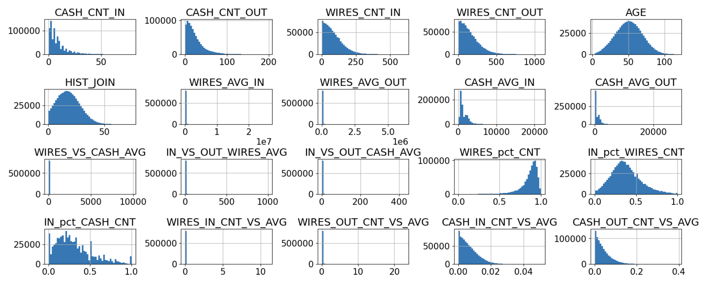
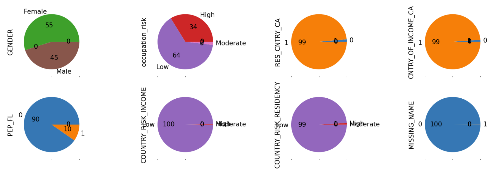

# Overview

 
 

## 1) Business background

- Problem statement see [main README](https://github.com/WillKWL/2023_IMI_BIGDataAIHUB/tree/main#task-2a-and-2b)
- Analytical problem = <ins>ordinal regression</ins>
  - Classify customers into "Low", "Medium" and "High" risk ratings
  - Why ordinal?
    - 4 levels of measurement = nominal, ordinal, interval and ratio
    - Nominal: order doesn't matter
    - Ordinal: order matters but difference is not in fixed interval
    - Interval: order matters + fixed interval
    - Ratio: order matters + fixed interval + only positive values
- Available data
  - Synthetic KYC and transactional data (UofT_nodes.csv)
  - Target variable = risk rating
- Use Case: Instead of resorting to a binary decision to deny a customer access to banking services, we can leverage the customer's risk score to allow access to a certain extent. For instance,
  - How long to freeze the customer's account?
  - How much monitoring to apply to the customer's activities?
  - What types of activity to provide access to the customer?
- Business terminology
  - [FINTRAC indicators](https://fintrac-canafe.canada.ca/guidance-directives/transaction-operation/indicators-indicateurs/fin_mltf-eng#s8) of a high-risk customer include:
    - Anonymity (having multiple transactions below the reporting threshold amount)
    - Speed over cost-effectiveness (splitting a single large wires transfer into multiple wire transfers)

## 2) Data Understanding

- 
- Volumetric analysis
  - Unit of analysis: customer
    - Each row represents summary statistics of a customer's transactions in the last 12 months
  - Number of rows = 1 million
  - Number of columns = 20
    - 1 target variable (risk rating) and 19 features of KYC and transactional data
- Features in the format of <Attribute (type): business meaning>
  - RISK (str, categorical): customer risk rating  (target variable) 
  - KYC
    - CUSTOMER_ID (int): customer_id  (unique identifier) 
    - COUNTRY_RISK_INCOME (int): country of income risk rating
    - COUNTRY_RISK_RESIDENCY (int): country of residency risk rating
    - NAME (str): name of customer
    - Gender (bool): gender of customer
    - BIRTH_DT (Date): date of birth
    - CUST_ADD_DT (Date): date of joining the bank
    - OCPTN_NM (int): occupation code -> occupation risk
    - RES_CNTRY_CA (Bool): whether customer lives in Canada
    - CNTRY_OF_INCOME_CA (Bool): whether customer receives income in Canada
    - PEP_FL (Bool): whether person is PEP
  - Transactions
    - CASH_SUM_IN (float): sum of cash in-transfer LTM
    - CASH_CNT_IN (int): count of cash in-transfer LTM
    - CASH_SUM_OUT (float): sum of cash out-transfer LTM
    - CASH_CNT_OUT (int): count of cash out-transfer LTM
    - WIRES_SUM_IN (float): sum of wire in-transfer LTM
    - WIRES_CNT_IN (int): count of wire in-transfer LTM
    - WIRES_SUM_OUT (float): sum of wire out-transfer LTM
    - WIRES_CNT_OUT (int): count of wire out-transfer LTM
  
- Hypothesis with Money Laundering [indicators involving transactions](<https://fintrac-canafe.canada.ca/guidance-directives/transaction-operation/indicators-indicateurs/fin_mltf-eng>)
  - Client frequents multiple locations utilizing cash, prepaid credit cards or money orders/cheques/drafts to send wire transfers overseas.
    - High count of transactions
  - Funds are deposited or received into several accounts and then consolidated into one before transferring the funds outside the country.
    - Multiple inflows with a single outflow
  - Immediately after transferred funds have cleared, the client moves funds, to another account or to another person or entity.
    - The sum of inflows is similar to the sum of outflows
  - Client sending to, or receiving wire transfers from, multiple clients.
    - High count of transactions
- Data exploration
  - Univariate analysis
    - Skewness and varying scales in numerical variables
      - 
    - Numerous categorical variables have a majority class >= 90%
      - 
  - Bivariate analysis
    - High correlation between numerical variables could impact inference
      - 
    - High conditional entropy between categorical variables could impact inference
      - 
  - Distribution of feature by target variable
    - High degree of overlapping between the three classes without any transformation performed on numerical variables
      - Over-/Under-sampling or adjusting class weights won't be effective
      - 
      - 
  - Some categorical variables (e.g. PEP_FL and occupation_risk) seem to provide a strong signal to separate the low risk rating from the other two classes
    - 
- Class imbalance in target variable
  - 
- Data quality
  - Missing values
    - Missing name for some customers might be a deliberate effort to avoid detection
    - Missingness in occupation risk, days since joined and gender seems to be random
  - Plausibility of values
    - Invalid records with CNT = 0 but SUM != 0
    - There are customers with age >= 118 (older than the world's record holder)

## 3) Data preparation

- Data cleaning
  - Fix data type
    - As datetime
      - BIRTH_DT, CUST_ADD_DT
    - From int to str
      - CUSTOMER_ID
    - As unordered category
      - OCPTN_NM, PEP_FL, RES_CNTRY_CA, CNTRY_OF_INCOME_CA, GENDER
    - As ordered category
      - COUNTRY_RISK_INCOME, COUNTRY_RISK_RESIDENCY, RISK
  - Impute missing values
    - Flag missingness if missingness might be a deliberate effort to avoid detection
      - Add dummy variable to indicate missing name
      - Add dummy variable to indicate data entry error (CNT = 0 but SUM != 0)
    - Random imputation for variables with missingness completely at random (MCAR)
      - Occupation risk, days since joined and gender
  - Pipeline to perform data cleaning
    - 
- Derived attributes based on domain knowledge
  - KYC data
    - Age = Today - BIRTH_DT
    - Years since joining = Today - CUST_ADD_DT
  - Transactional data
    - Rationale: while a model like random forest can easily learn simple numerical operations between two features including addition (A+B), subtraction (A-B) and multiplication (AxB), it can hardly learn the reciprocal (A/B) so we need to provide it as a feature
      - Average transaction amount ($) = SUM / CNT for both incoming and outgoing cash flows
      - Ratio of average cash transfers to average wire transfers
    - Balance of cash and wire transfers
- Single-attribute transformation
  - Numerical variables: non-linear quantile transformation to normal distribution such that there is more separation among the three classes
    - Assumption: only the relative ranking but not the raw value of a feature matters
    - 
  - Categorical variables
    - Unordered category: OneHotEncoder
      - There is no need to collapse infrequent categories as infrequent class might represent minority class in target variable (e.g. "High" risk rating only constitutes 5% of the data)
    - Ordered category: thermometer encoding
      - We need an encoding scheme that preserves the order of the categories
      - Reference: [(2012) Evaluating the Impact of Categorical Data Encoding and Scaling on Neural Network Classification Performance: The Case of Repeat Consumption of Identical Cultural Goods (Elena Fitkov-Norris, Samireh Vahid, and Chris Hand from Kingston University London)](https://www.researchgate.net/publication/262173733_Evaluating_the_Impact_of_Categorical_Data_Encoding_and_Scaling_on_Neural_Network_Classification_Performance_The_Case_of_Repeat_Consumption_of_Identical_Cultural_Goods)
    - Rescale dummy variables to -2 to +2 such that the range of categorical variables cover roughly 95% confidence interval of normal distribution
  - Overview of single-attribute transformation for each data type
    - 
- Final pipeline to prepare data for modeling
  - 
  - 

## 4) Modeling

- Problem formulation: <ins>Ordinal Regression</ins> (aka Ordinal Classification in some papers)
  - Main paper we referred to: [(2015) Ordinal Regression Methods: Survey and Experimental Study](https://ieeexplore.ieee.org/abstract/document/7161338)
    - Ordinal binary decomposition
      - One of the many approaches to solve ordinal regression
  - Benefits:
    - "It is important to note that naïve approaches and ordinal binary decompositions can be applied using almost any base binary classifier or regressor."
    - Our testing showed that ordinal binary decomposition offered significant improvement in test performance over the multi-class classification especially for linear models (e.g. multinomial logistic regression)
      - Shortcoming of multi-class classification: straightforward but 0-1 misclassification matrix ignores ranking of the labels
    - AML regulators prefer linear models with a high degree of model interpretability and transparency
    - Binary classifiers are well-studied and many algorithms are readily available
  
### 1st part: Nominal Decompositions

- Different ways to decompose an ordinal regression problem into binary subproblems:
  - Ordered partition
  - OneVsNext decomposition
  - OneVsFollowers decomposition
  - OneVsPrevious decomposition
  - 

### 2nd part: Combining subproblems into ordinal regression model

- Option 1: multiple model approach (i.e. one model for each subproblem)
  - One of the many methods is $K-1$ binary classification and we implemented the methodology as a wrapper for sklearn classifier
    - 
    - Paper: [(2001, Frank and Hall) A simple approach to ordinal classification](https://www.cs.waikato.ac.nz/~eibe/pubs/ordinal_tech_report.pdf)
    - A $K$-class ordinal problem can be converted into $K-1$ binary class problems
    - Potential issue: rank inconsistency
      - e.g. the outputs from K-1 binary class problems are [0.91, 0.91, 0.49, 0.72, 0.11]. Iterating from left to right would result in a prediction label of 2 (since 0.49 < 0.5), even though the right answer might just as well be 4 (since 0.72 > 0.5)
      - We decided to ignore for now as we want to see the testing performance first
- Option 2: multiple-output single model approach (i.e. one model for all subproblems)
  - One of the many methods is extended binary classification and we implemented as a wrapper for sklearn classifier
    - 
    - Paper: 
      - [(2007, Li and Lin) Ordinal Regression by Extended Binary Classification](https://papers.nips.cc/paper/2006/file/019f8b946a256d9357eadc5ace2c8678-Paper.pdf)
      - [(2007 Cardoso, Costa) Learning to Classify Ordinal Data: The Data Replication Method](https://www.jmlr.org/papers/volume8/cardoso07a/cardoso07a.pdf)
    - Potential issue: lack of flexibility for high-dimensional data
      - While it is an elegant solution to solve 2 binary subproblems at once by just increasing the number of dimension by 1 and drawing the decision boundary with 1 binary classifier, the approach might not be flexible enough for less separable data
# stop here
- Final approach: OneVsFollowers decomposition (i.e. decomposing into Low vs Medium, High and Medium vs High) + Binary classifier
    - Result suggests significant improvement over baseline (i.e. multi-class nominal classification)
    - 
- Evaluation metric = <ins>Multipartite AUC</ins>
  - Implemented as MultipartiteAUC (quote the source code line here)
  - Paper: (2009, Furnkranz, Hullermeier, Vanderlooy) [Binary Decomposition Methods for Multipartite Ranking](https://link.springer.com/content/pdf/10.1007/978-3-642-04180-8_41.pdf)
  - Intuition: a model with a high multipartite AUC score can rank
    - Medium risk customers above low risk customers &
    - High risk customers above low risk customers &
    - High risk customers above medium risk customers
    - 
  - Macro-weighted to address class imbalance
  - Essentially OneVsOne Macro AUC but with the flexibility to calculate a weighted average
    - Also see sklearn implementation of [average_multiclass_ovo_score](https://github.com/scikit-learn/scikit-learn/blob/main/sklearn/metrics/_base.py)
  - Other resources
    - (2001, Hand and Till) [A Simple Generalization of the Area Under the ROC Curve for Multiple Class Classification Problems](https://link.springer.com/article/10.1023/A:1010920819831)
    - (2009, Baccianella, Andrea Esuli and Fabrizio Sebastiani) [Evaluation Measures for Ordinal Regression](https://ieeexplore.ieee.org/stamp/stamp.jsp?tp=&arnumber=5364825)
    - (2022) [Class distance weighted cross-entropy loss](https://arxiv.org/pdf/2202.05167.pdf)

- Consider a list of appropriate modeling techniques
  - logistic regression
  - Gaussian naive Bayes
  - decision tree
  - extra trees
  - histogram-based gradient boosting
  - bagging classifier
  - AdaBoost
  - LightGBM
- Procedure to test a model's quality and validity
  - Stratified shuffle split for both train-test split and cross-validation in hyperparameter tuning due to class imbalance
    - 80-20 train-test split
    - 5-fold cross validation
  - Evaluation metric = multipartite AUC
- Rationale for hyperparameter tuning
  - Shortlisted LightGBM and histogram-based gradient boosting based on 5-fold cross validation score
    - 
  - Not much hyperparameter tuning is needed as the default parameters already perform well
    - Tune learning rate and number of estimators for both LightGBM and histogram-based gradient boosting to improve generalization performance
- Final model
  - LightGBM as the best model after hyperparameter tuning with RandomizedSearchCV
    - 
- assumptions for chosen model
- Model assessment
  - Distribution of predicted probabilities for each risk rating
    - 
  - Evaluation metric / lift and gain tables
    - We were able to achieve a multipartite AUC of 0.98 on the test set
      - with almost perfect classification for low vs medium risk customers and for medium vs high risk customers
    - 
  - Lift and gain charts
    - Within the 1st decile, our model achieved
      - 2.7x lift in ranking low vs medium risk customers,
      - 10.0x lift in ranking low vs high risk customers, and
      - 5.2x lift in ranking medium vs high risk customers
    - 
    - 
    - 
    - 
  
  - insights in why a certain model / certain hyperparameter lead to good / bad results

## 5) Evaluation

- Results = Models + Findings
- Now we have seen the model is useful. What kind of insights can the model provide?
- Interpretation of performance on unseen data
  - Feature importance and permutation importance
    - While feature importance is readily available for tree-based models, it favors features with high cardinality and may neglect important categorical features
    - Furthermore, feature importance measures indicates the relative importance of each feature during model training but it does not indicate how much the model's performance in unseen data would suffer if the feature was removed
    - To address this issue, we also computed permutation importance for each feature on the test set
    - PEP_FL was the 5th most important feature by permutation importance but was not even in the top 10 by feature importance
    - 
  - SHAP values
    - SHAP values provide a more granular view of feature importance by showing how much each feature contributes to each prediction
    - 
    - 
  - Partial dependence plots
    - Partial dependence plots show how the average prediction changes when a feature is varied
    - Low risk
      - 
    - Medium risk
      - 
    - High risk
      - 
- Interpretation of important features in business terms
  - The plots of WIRES_AVG_OUT, CASH_AVG_OUT, WIRES_AVG_IN and CASH_AVG_IN by risk rating confirms our hypothesis that high-risk customers tend to have an average transaction amount that is higher than low-risk customers but yet not so high as to be conspicuous
  - The plot of WIRES_BALANCE also confirms our hypothesis that high-risk customers tend to withdraw funds immediately after receiving them
  - 
  - 
- Prescriptive analytics = How to use the model
  - Where to pick the cutoff
    - 
  - Asymmetric misclassification cost matrix
    - 
    - 
  - Optimized cutoff threshold
    - 
- findings that are important in
  - meeting business objectives
  - leading to new questions
  - recommendations for new data mining projects
- review process
  - for each stage, ask
    - was it necessary
    - was it executed optimally
    - in what ways can it be improved
  - identify failures
  - identify misleading steps
  - identify possible alternative actions and / or unexpected paths in the process
- list possible actions
  - with reasons for / against each option
  - rank each possible action
- More resources
  - <https://fintrac-canafe.canada.ca/guidance-directives/guidance-directives-eng>
  - <https://towardsdatascience.com/how-to-perform-ordinal-regression-classification-in-pytorch-361a2a095a99>
  - <https://towardsai.net/p/l/from-classification-to-ordinal-regression>
  - from coarse-grained to fine-grained <https://www.nature.com/articles/s41598-020-79007-5#Abs1>
  - Thermometer scaling (aka label extension)
  - (2007, Cheng) [A Neural Network Approach to Ordinal Regression](https://arxiv.org/pdf/0704.1028.pdf)
  - CORAL framework for rank consistency
    - (2020, Cao, Mirjalili, Raschka) [Rank consistent ordinal regression for neural networks with application to age estimation](https://arxiv.org/pdf/1901.07884.pdf)
    - label extension + weight sharing at penultimate layer
