# Highlights
- 
# Overview
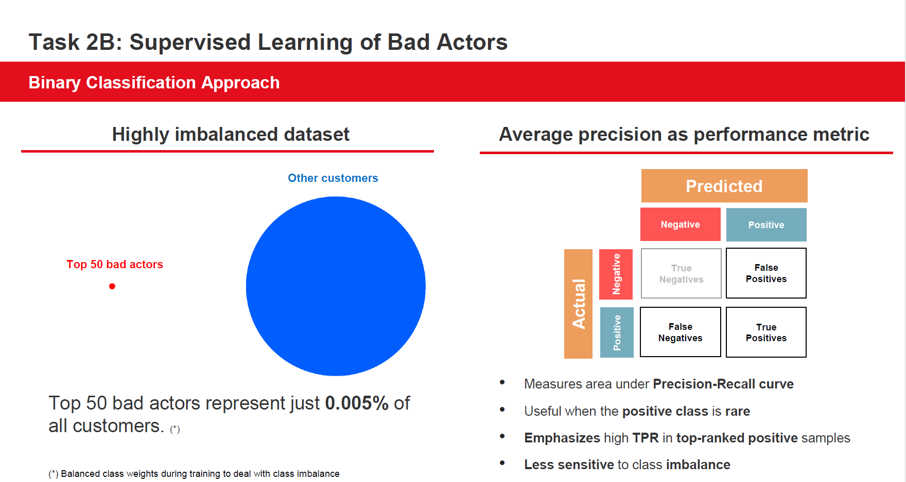
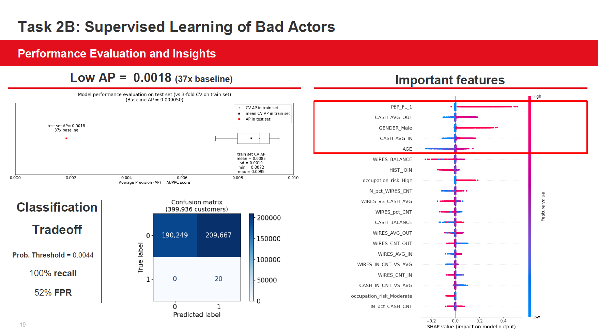

# 1) Business background
- Problem statement see [main README](https://github.com/WillKWL/2023_IMI_BIGDataAIHUB/blob/main/README.md#L28)
- Analytical problem
  - Binary classification with highly imbalanced data (50 bad actors / 1,000,000 customers = 0.005%)
- Data available
  - Scotiabank synthetic data: UofT_nodes.csv (KYC, Transactional data and Risk Rating)
- Use case
  - Once we have identified the bad actors, we should consider punitive actions such as closing their accounts and reporting them to the authorities.

 
# 2) Data Understanding
- See Task 2A README
- Class imbalance
  - 50 bad actors / 1,000,000 customers = 0.005%
  - 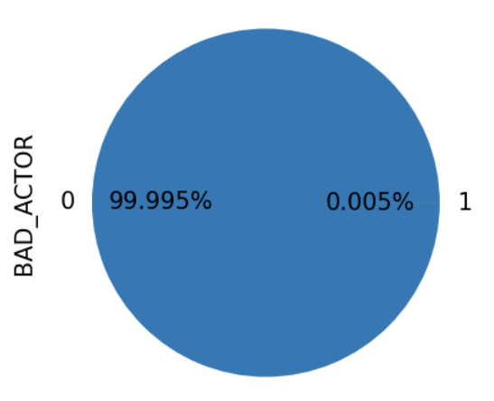
- volumetric analysis
  - history of the data
  - quantity of data available (number of rows and what columns are there)
- attribute types and values
  - check attribute types
  - check attribute value ranges
  - meaning of each attribute in business terms
  - basic statistics of each attribute (distribution, average, min, max, sd, mode, skewness etc.)
  - attributes (which ones are relevant / irrelevant)
  - industry domain knowledge
  - data imbalance?
- data exploration
  - hypothesis
- data quality
  - coverage (if all possible values are represented)
  - missing values
  - plausibility of values

# 3) Data preparation
- data cleaning report
  - decisions and actions taken to address data quality problems
- derived attributes
  - domain knowledge
  - constraints in modeling approach (e.g. heteroscedasticity)
  - impute missing values
- single-attribute transformation

# 4) Modeling
- Evaluation metric
  - Average precision = area under precision-recall curve
    - Preferable to AUROC for highly imbalanced data
    - [sklearn documentation](https://scikit-learn.org/stable/modules/generated/sklearn.metrics.average_precision_score.html#sklearn.metrics.average_precision_score)
- consider a list of appropriate modeling techniques
  - Isolation forest
  - Logistic regression
  - Gaussian Naive Bayes
  - Decision tree
  - Random forest
  - Extra trees
  - Histogram-based Gradient Boosting
  - Bagging classifier
  - XGBoost classifier
  - LightGBM classifier
  - 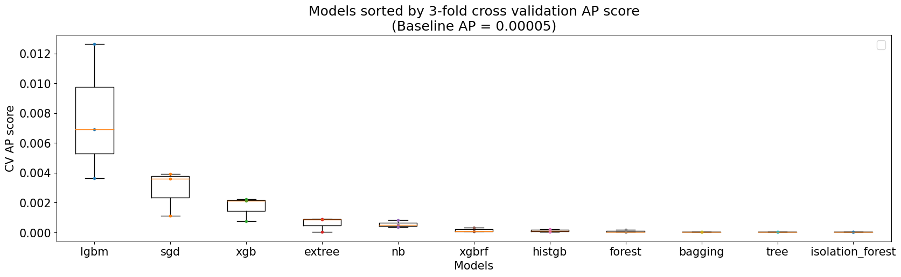
- constraints for no deep learning (interpretability, computation time, knowledge)
- assumptions for chosen model
- define procedure to test a model's quality and validity
  - Stratified shuffle split for both train-test split and cross validation to address class imbalance
    - 60-40 train-test split (30 bad actors in train set and 20 bad actors in test set)
    - 3-fold cross validation (10 bad actors in each fold)
- build model
  - Grid search to determine possible range of hyperparameters to avoid overfitting on the 50 bad actors
    - LightGBM's range of hyperparameters
      - max_bin: 150 to 300
      - num_leaves: 20 to 40
      - min_data_in_leaf: 10 to 30
      - bagging_fraction: 0.1 to 1.0
      - feature_fraction: 0.1 to 1.0
      - lambda_l1: 0.01 to 100 (log-uniform)
      - lambda_l2: 0.01 to 100 (log-uniform)
      - min_split_gain: 0.0001 to 0.01 (log-uniform)
      - max_depth: 15 to 30
      - extra_trees: True
    - XGBoost's range of hyperparameters 
      - max_depth: 2 to 10
      - n_estimators: 50 to 150
      - max_bin: 100 to 1000
      - min_child_weight: 0.1 to 10 (log-uniform)
      - subsample: 0.2 to 1.0
      - colsamples_bytree: 0.2 to 1.0
      - colsamples_bylevel: 0.2 to 1.0
      - colsamples_bynode: 0.2 to 1.0
    - Logistic regression's range of hyperparameters
      - alpha: 0.0001 to 0.1 (log-uniform)
- Bayesian optimization from skopt to tune hyperparameters
  - Average precision
    - 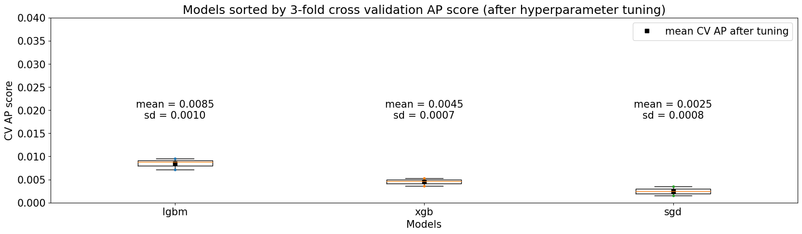
  - AUROC
    - 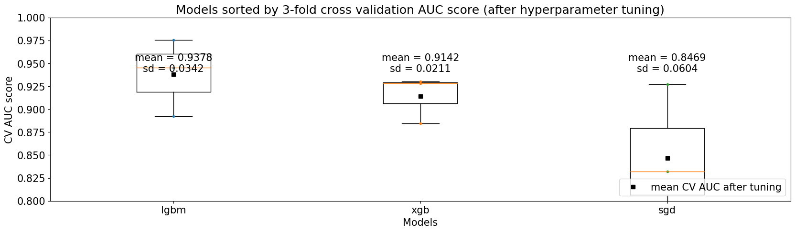
- model description
  - final set of hyperparameters
  - 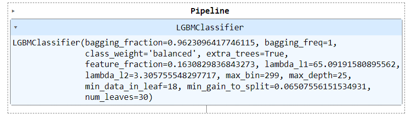
- assess model
  - Average precision 
    - Despite thorough hyperparameter tuning, the model still cannot perform as well in the test set as in cross-validation
    - 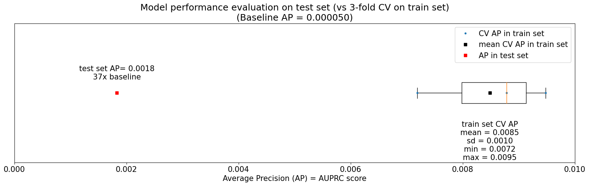
  - AUROC
    - 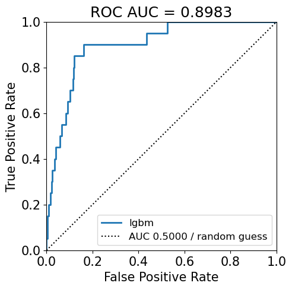
  - Lift and gain chart
    - 6.5x lift for 1st decile
    - 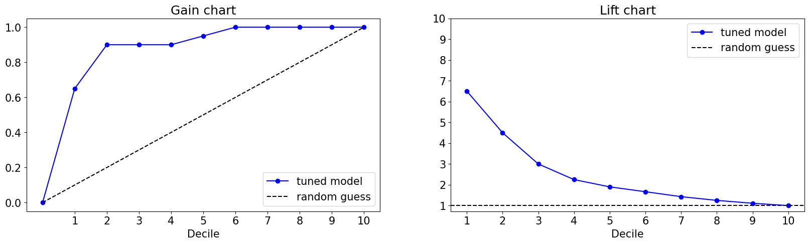
  - Distribution of predicted probabilities
    - 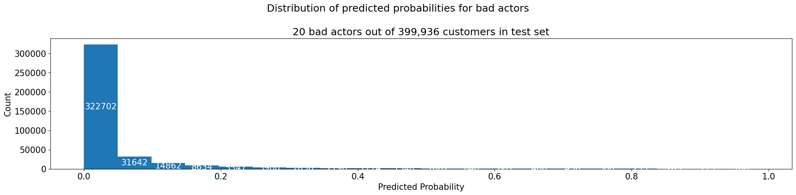
  - Precision-recall curve
    - 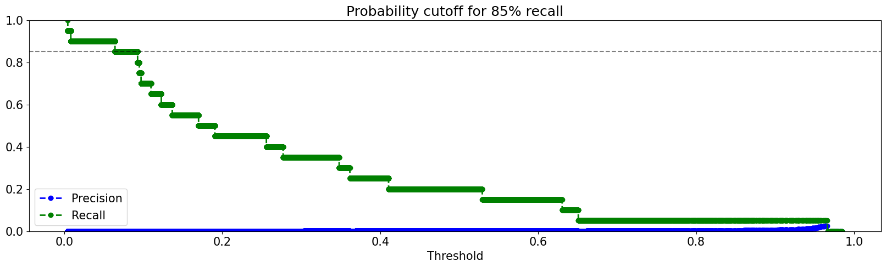
  - test result
  - interpretation of performance on unseen data
  - interpretation in business terms
  - analyze potential deployment of each result
    - Optimized cutoff threshold based on misclassification cost
      - 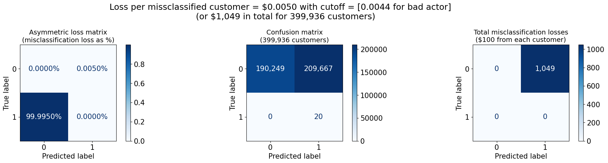
  - insights in why a certain model / certain hyperparameter lead to good / bad results

# 5) Evaluation
- Results = Models + Findings
- Overall, performance is not good and model is prone to overfit on the handful of bad actors in the training set
  - Solution: Task 3 [link]
- Feature importance and permutation importance
  - 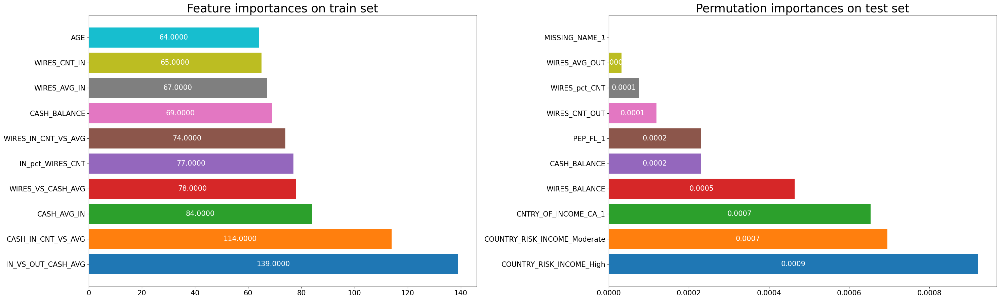
- EDA of important features
  - 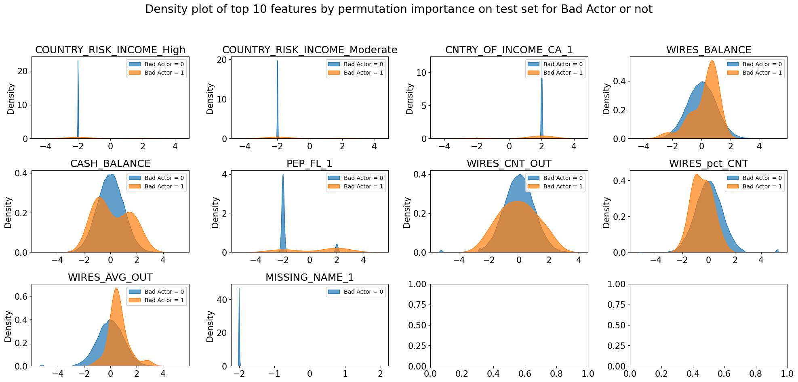
- SHAP values
  - 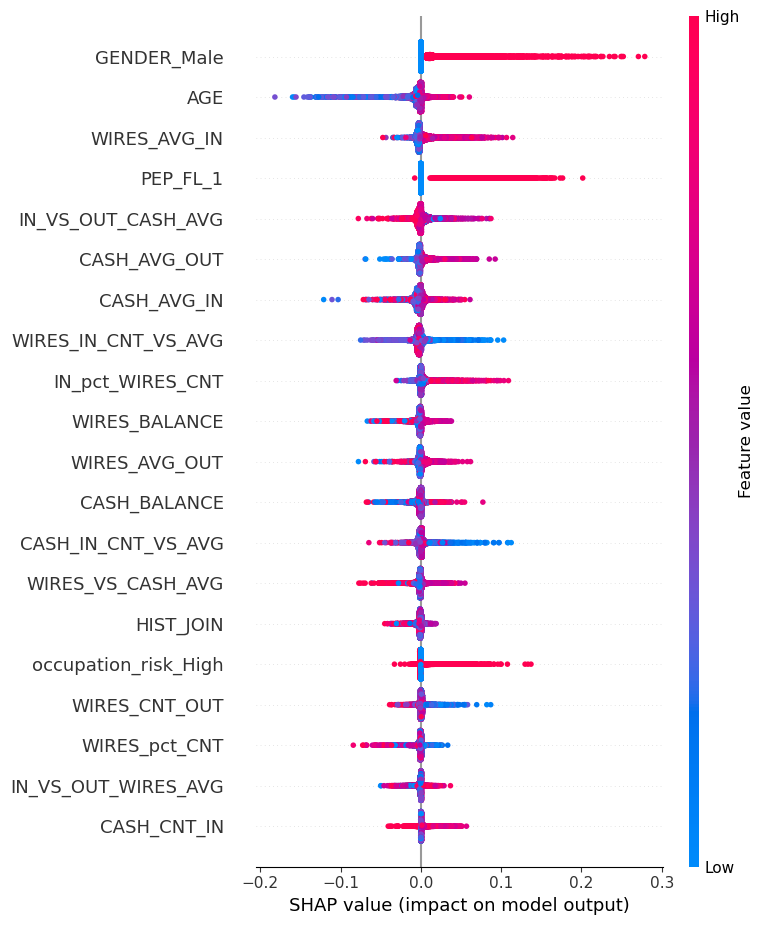
- Partial dependence plots
- findings that are important in
  - meeting business objectives
  - leading to new questions
  - recommendations for new data mining projects
- review process
  - for each stage, ask
    - was it necessary
    - was it executed optimally
    - in what ways can it be improved
  - identify failures
  - identify misleading steps
  - identify possible alternative actions and / or unexpected paths in the process
- list possible actions
  - with reasons for / against each option
  - rank each possible action
