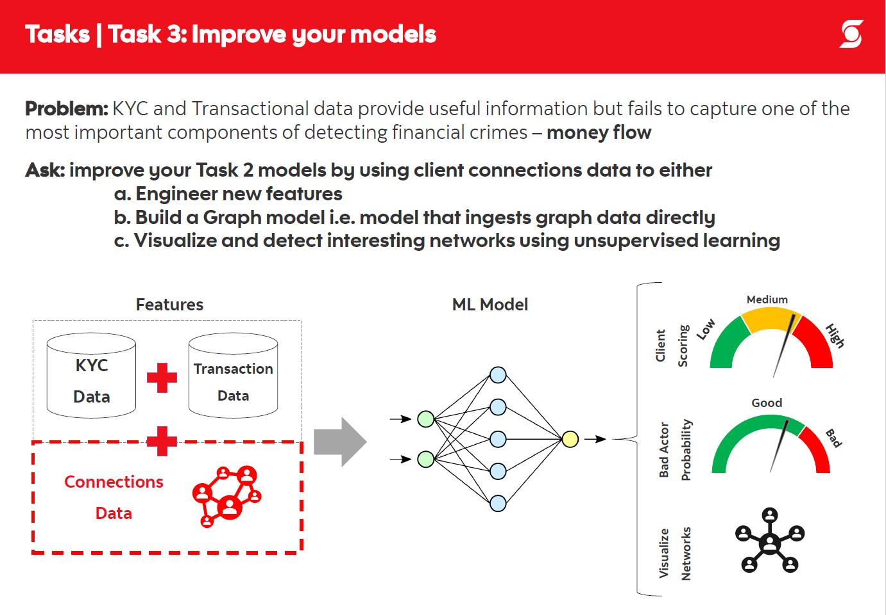

# Highlights
- 
# Overview

# 1) Business background
- Problem statement
- Use Case
  - Suspicious clients will not be onboarded, or if they are already onboarded, their accounts will be frozen

- Data available
  - Scotiabank list of 1 million customer names (synthetic data)
  - [OpenSanctions watchlist](https://www.opensanctions.org/datasets/default/)
- Business terminology
- Analytical problem
  - Improve Task 2 models by using client connections to either:
    - Extract new features
    - Fit graph models directly
    - Visualize interesting networks
- Success criteria
  - Qualitative assessment of the matches
 
# 2) Data Understanding
- volumetric analysis
  - history of the data
  - quantity of data available (number of rows and what columns are there)
- attribute types and values
  - check attribute types
  - check attribute value ranges
  - meaning of each attribute in business terms
  - basic statistics of each attribute (distribution, average, min, max, sd, mode, skewness etc.)
  - attributes (which ones are relevant / irrelevant)
  - industry domain knowledge
  - data imbalance?
- data exploration
  - hypothesis
- data quality
  - coverage (if all possible values are represented)
  - missing values
  - plausibility of values

# 3) Data preparation
- data cleaning report
  - decisions and actions taken to address data quality problems
- derived attributes
  - domain knowledge
  - constraints in modeling approach (e.g. heteroscedasticity)
  - impute missing values
- single-attribute transformation

# 4) Modeling
- consider a list of appropriate modeling techniques
- constraints for no deep learning (interpretability, computation time, knowledge)
- assumptions for chosen model
- define procedure to test a model's quality and validity
  - train / test split
  - how to define folds for cross validation
  - performance measure
- build model
  - rationale for initial hyperparameters
  - hyperparameter tuning
- model description
  - final set of hyperparameters
- assess model
  - evaluation criteria / lift and gain tables
  - test result
  - interpreation of performance on unseen data
  - interpretaion in business terms
  - analyze potential deployment of each result
  - insights in why a certain model / certain hyperparameter lead to good / bad results

# 5) Evaluation
- Results = Models + Findings
- findings that are important in
  - meeting business objectives
  - leading to new questions
  - recommendations for new data mining projects
- review process
  - for each stage, ask
    - was it necessary
    - was it executed optimally
    - in what ways can it be improved
  - identify failures
  - identify misleading steps
  - identify possible alternative actions and / or unexpected paths in the process
- list possible actions
  - with reasons for / against each option
  - rank each possible action
