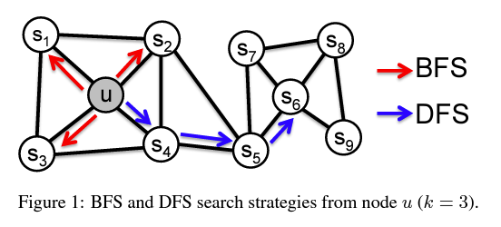

# Overview

## 1) Business background

- Problem statement see [main README](https://github.com/WillKWL/2023_IMI_BIGDataAIHUB/tree/main#task-3)
- Analytical problem
  - Improve Task [2A](https://github.com/WillKWL/2023_IMI_BIGDataAIHUB/blob/main/Task2A) and [2B](https://github.com/WillKWL/2023_IMI_BIGDataAIHUB/blob/main/Task2B) models by using client connections to either:
    - Extract new features
    - Fit graph models directly
    - Visualize interesting networks
- Available data
  - Same as Task 2: Synthetic KYC and transactional data (UofT_nodes.csv)
  - Graph data: Synthetic transactions between customers (UofT_edges.csv)
    - Customer id for sender and receiver
    - Transaction amount

## 2) Graph embeddings to enrich data

- Apart from data provided in Task 2, connections between customers may provide additional clues about suspicious activity
  - For example in a fraud ring, if a customer is connected to many bad actors, they may be a bad actor themselves
- Connections between customers can be represented by a directed graph with edges weighted by the amount of money transferred
- Approach to perform feature engineering using graph as high-dimensional input
  - While we can manually engineer features from the graph such as min, max, standard deviation and correlation coefficients of a fixed number of neighbors for each customer (e.g. 1-hop forward and backward),
  - Self-supervised learning can automatically help us extract useful representation of the graph for downstream tasks in the form of embeddings
- Volumetric analysis
  - In our graph data, there are 361,000 customers (nodes) and 466,000 transactions (directed edges)
  - Also, the graph contains more medium- and high-risk customers VS Task 2 dataset
    - 
  - For the remaining 639,000 customers in the dataset without any transactions provided, we randomly imputed graph embeddings stratified by target variable such that if graph embeddings of bad actors are clustered together, the imputed graph embeddings of the remaining customers will also be clustered together
- Graph statistics
  - Distribution of degree in the graph
    - Most nodes have only 1 neighbor, while 95% of all nodes have fewer than 6 neighbors
    - 
  - Node importance measures
    - degree centrality, eigenvector centrality, closeness centrality, betweenness centrality, PageRank
  - Distribution of length of shortest path between nodes
    - Most nodes are only 2 hops away from each other, while 95% of all nodes are fewer than 3 hops away from each other
    - 
- Generate embeddings using node2vec
  - node2vec is a self-supervised learning algorithm that learns embeddings of nodes in a graph by optimizing a neighborhood-preserving objective
  - To estimate the likelihood of a node's neighbors, node2vec uses a random walk procedure to sample a fixed number of neighbors for each node
  - Efficiency of node2vec's random walk procedure
    - Edge weights (transaction amounts) normalized by the sum of outgoing edge weights (transaction amounts) represent the probability of money moving from one node (customer) to another
    - By simulating a random walk of length $l > k$ we can generate $k$ samples for $l − k$ nodes at once due to the Markovian nature of the random walk
      - $l$ = length per walk
      - $k$ = window size
      - assume $k = 5$ given distribution of shortest paths in the graph, $l = 105$ will give 5 samples for 100 nodes
  - Structural equivalence VS homophily
    - Nodes in network could be organized base on communities they belong to (i.e., homophily); in other cases, the organization could be based on the structural roles of nodes in the network (i.e., structural equivalence)
      - 
    - node2vec is flexible enough to capture both structural equivalence and homophily by tuning parameters p and q to control the exploration-exploitation tradeoff of the random walk in using breath-first search (BFS) and depth-first search (DFS)
      - By default, p = 1 and q = 1, which is equivalent to unbiased random walk
      - If p < 1, BFS is favored (exploration by going sideways)
        - The neighborhoods sampled by BFS lead to embeddings that correspond closely to structural equivalence
      - If q < 1, DFS is favored (exploitation by going deeper)
        - In DFS, the sampled nodes more accurately reflect a macro-view of the neighborhood which is essential in inferring communities based on homophily
      -  
  - We used the following parameters to generate graph embeddings for each node in the graph
    - p = 1 and q = 1 (an unbiased random walk)
    - walk length = 100
    - dimensions = 100
    - num_walks = 15
  - Reference:
    - Paper: [node2vec Scalable Feature Learning for Networks](http://arxiv.org/abs/1607.00653)
    - Python implementation: [node2vec GitHub repository](https://github.com/eliorc/node2vec)
- Visualization of graph embeddings
  - Visualizing the graph embeddings in 2D using t-SNE shows that bad actors often cluster together and act as middle men for layering and integration in the process of money laundering
  - 
  - 

## 3) Data Understanding and Preparation

- See more details about exploratory data analysis from [Task 2A README](https://github.com/WillKWL/2023_IMI_BIGDataAIHUB/blob/main/Task2A)
  - Data understanding
    - Volumetric analysis
    - Hypothesis based on domain knowledge
    - Data exploration
    - Data quality assessment
  - Data preparation
    - Fix data types
    - Treat missing values
    - Derived attributes based on domain knowledge
    - Single-attribute transformation

## 4) Modeling

- See more details about ordinal regression from [Task 2A README](https://github.com/WillKWL/2023_IMI_BIGDataAIHUB/blob/main/Task2A) and binary classification from [Task 2B README](https://github.com/WillKWL/2023_IMI_BIGDataAIHUB/blob/main/Task2B)
- Best model for Task 2A after hyperparameter tuning
  - Balance class weights to address class imbalance
  - 
- Best model for Task 2B after hyperparameter tuning
  - Balance class weights to address class imbalance
  - 

## 5) Evaluation

- Not much improvement on Task 2A after adding graph embeddings to dataset as our model already performed well on the original dataset
- Improvements on Task 2B
  - Average precision on test set increased 10 times from 0.0018 to 0.0184
    - 368x better than baseline of (random guess = 50 / 1,000,000 = 0.00005)
    - But again, it still seems to have overfitted as it cannot perform as well in the test set as in cross-validation
    - 
  - AUROC on test set improved slightly from 0.8983 to 0.9056
  - False Positive Rate dropped by 11% from 52% to 41% when we set the threshold to achieve 100% recall
    - 
  - Lift and gain charts
    - Our model's lift in 1st decile improved from 6.5x to 7.0x
    - 
  - Graph embeddings were selected as some of the most important features
    - 
    - 

## 6) Next steps

- Recommendations for new projects
  - Instead of extracting graph embeddings to enrich the dataset, we can fit graph models (e.g. graph neural networks) directly on the graph data
  - Neo4j for graph analytics
    - https://neo4j.com/developer/desktop-csv-import/#loading-data
    - https://www.sisu.io/posts/embeddings/
    - Neo4j Sandbox
    - https://towardsdatascience.com/graph-embeddings-the-summary-cc6075aba007
    - https://towardsdatascience.com/graph-embeddings-explained-f0d8d1c49ec
    - https://towardsdatascience.com/visualizing-graph-embeddings-with-t-sne-in-python-10227e7876aa
    - https://towardsdatascience.com/getting-started-with-graph-embeddings-2f06030e97ae
    - https://towardsdatascience.com/create-a-graph-database-in-neo4j-using-python-4172d40f89c4
    - https://graphacademy.neo4j.com/courses/modeling-fundamentals/
    - https://towardsdatascience.com/understanding-graph-embeddings-with-neo4j-and-emblaze-7e2d6ef56b8c
    - https://github.com/Lemon-Soup/NetworkChart
    - https://www.youtube.com/watch?v=N7JVM84b8aM&ab_channel=TinyVizTalks